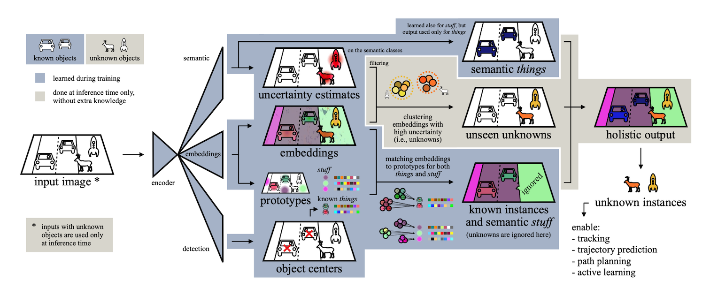

# Segmenting Known Objects and Unseen Unknowns without Prior Knowledge (ICCV 2023)
U3HS finds unknowns as highly uncertain regions and clusters their corresponding instance-aware embeddings into individual objects. 
For the first time in panoptic segmentation with unknown objects, 
U3HS is trained without unknown categories, reducing assumptions, 
simplifying the training data collection, and leaving the settings as unconstrained as in real-life scenarios.



This is the **Pytorch re-implementation** of the paper [Segmenting Known Objects and Unseen Unknowns without Prior Knowledge](https://arxiv.org/abs/2209.05407) based on Detectron2.

## Disclaimer
* This is a **re-implementation** of U3HS framework, **not the official code**, it is not guaranteed to reproduce all numbers in the paper, please refer to the original numbers from [Segmenting Known Objects and Unseen Unknowns without Prior Knowledge](https://arxiv.org/abs/2209.05407) when making comparison.

## Installation
See [installation instructions](docs/INSTALL.md).

## Getting Started
See [Preparing Datasets for U3HS](datasets/README.md).

See [Getting Started with U3HS](docs/GETTING_STARTED.md).

## Results
### Cityscapes panoptic segmentation
<table>
<thead>
  <tr>
    <th rowspan="2">Method</th>
    <th colspan="3">Lost&amp;Found</th>
    <th colspan="3">open Cityscapes</th>
    <th colspan="3">closed Cityscapes</th>
    <th rowspan="2">download</th>
  </tr>
  <tr>
    <th>PQ</th>
    <th>RQ</th>
    <th>SQ</th>
    <th>PQ</th>
    <th>RQ</th>
    <th>SQ</th>
    <th>PQ</th>
    <th>RQ</th>
    <th>SQ</th>
  </tr>
</thead>
<tbody>
  </tr>
    <tr>
    <td>U3HS-Paper</td>
    <td>7.94</td>
    <td>12.37</td>
    <td>64.24</td>
    <td>41.21</td>
    <td>51.67</td>
    <td>79.77</td>
    <td>46.53</td>
    <td>58.99</td>
    <td>78.87</td>
  
  <tr>
    <tr><td align="left"><a href="/configs/Cityscapes-PanopticSegmentation/u3hs_R_52_90k_bs16_crop_512_1024.yaml">U3HS-reimplemented</a></td>
    <td>10.000</td>
    <td>14.676</td>
    <td>68.141</td>
    <td>40.671</td>
    <td>51.509</td>
    <td>74.708</td>
    <td>49.489</td>
    <td>62.387</td>
    <td>76.973</td>
    <td align="center"><a href="https://drive.google.com/file/d/1-4gyFUEK3xHzy_-F_q-jT7xahwX8yl-L/view?usp=share_link">model</a>&nbsp;|&nbsp;<a href="https://drive.google.com/file/d/1-CeG1Sl56EEzcPFoE95hgRExSgNemAqb/view?usp=sharing">metrics</a></td>
    </tr>
</tbody>
</table>


## Citing U3HS
If you find this code helpful in your research or wish to refer to the baseline results, please use the following BibTeX entry.

```BibTeX
@inproceedings{gasperini2023segmenting,
  title={Segmenting known objects and unseen unknowns without prior knowledge},
  author={Gasperini, Stefano and Marcos-Ramiro, Alvaro and Schmidt, Michael and Navab, Nassir and Busam, Benjamin and Tombari, Federico},
  booktitle={Proceedings of the IEEE/CVF international conference on computer vision},
  pages={19321--19332},
  year={2023}
}
```

## Acknowledgements
We have used utility functions from other wonderful open-source projects, we would espeicially thank the authors of:
- [DeepLab](https://github.com/tensorflow/models/tree/master/research/deeplab)
- [Panoptic-DeepLab](https://github.com/facebookresearch/detectron2/tree/main/projects/Panoptic-DeepLab)
- [Discriminative Loss](https://github.com/nyoki-mtl/pytorch-discriminative-loss)
- [Detectron2](https://github.com/facebookresearch/detectron2)
- [TorchVision](https://github.com/pytorch/vision)

